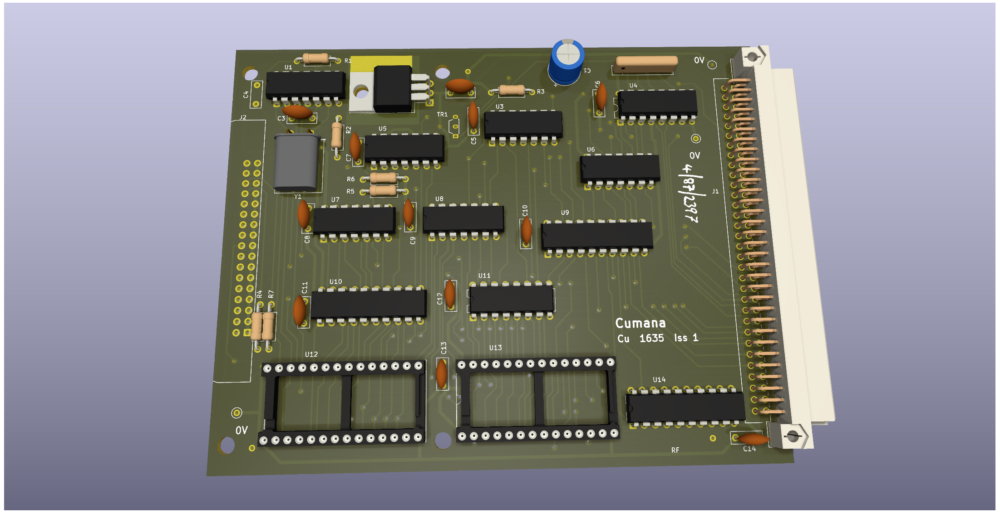
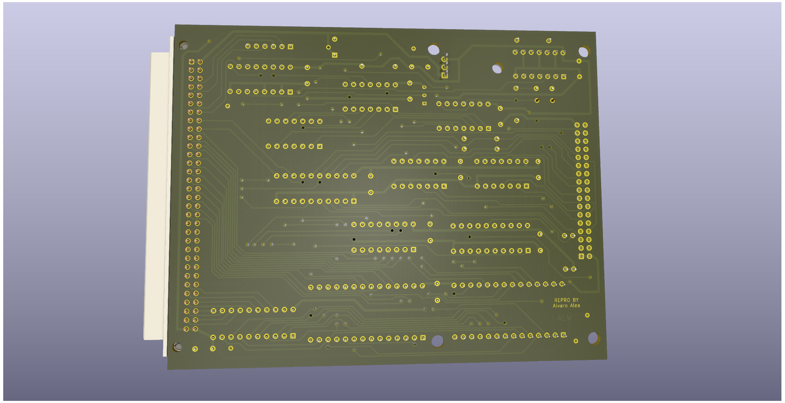

# Cumana Disk Interface for Sinclair QL

A clone of the Cumana's Floppy Disk Interface for Sinclair QL
(PCB issue 1, ROM version 1.14)

# WARNING: This board has not been tested.

### The Board

There are two knows version of the ROM, 1.14 and 1.17. unknow diferences between revisiones of ROM.

It use the standar stugart conector, so a plain cable can have up to 4 disk drives, that shall be correctly configured as DS0, DS1, DS2 or DS3.

It use a WD1770 disc controller, and is expected that will be compatible with WD1772 (not checked), WD1773 is not compatible.

Thanks to Max from retrowiki for providing me with a board so I can take pictures and check tracks  that allow me to capture the schema.

