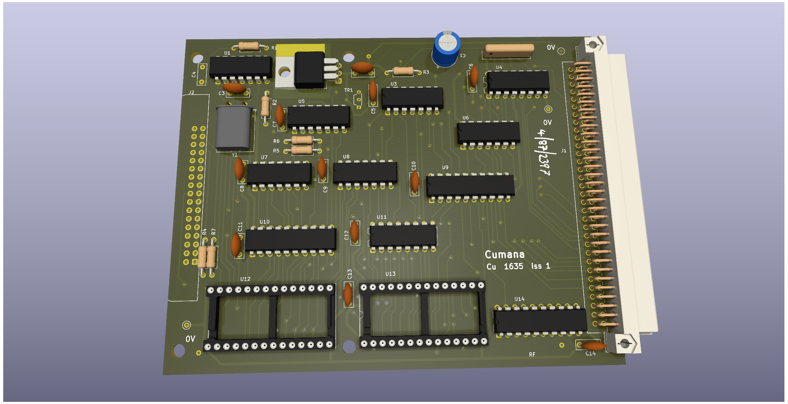
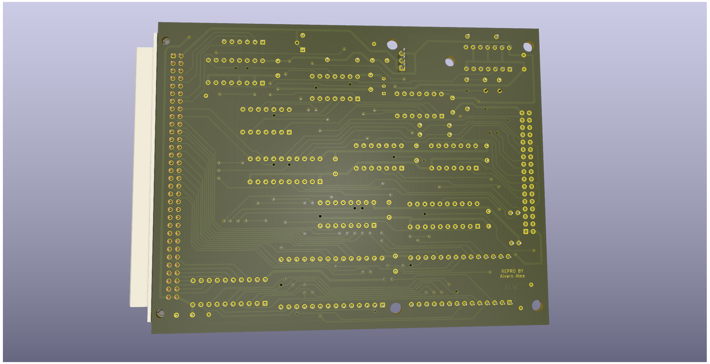

# Cumana Disk Interface for Sinclair QL

A clone of the Cumana's Floppy Disk Interface for Sinclair QL
(PCB issue 1, ROM version 1.14)

This board has been suessfully tested with ROM 1.16, real floppy disc and gotek.

### The Board

There are two knows version of the ROM, 1.14 and 1.16. unknow diferences between revisiones of ROM.

It use the standar stugart conector, so a plain cable can have up to 4 disk drives, that shall be correctly configured as DS0, DS1, DS2 or DS3.

It use a WD1770 disc controller, but is compatible with WD1772 (you can need to configure start speed), WD1773 is not compatible.

Be aware, when install the transistor, is C,B,E with C near the 7805.

Thanks to Minialler from retrowiki for providing me with a board so I can take pictures and check tracks  that allow me to capture the schema.

